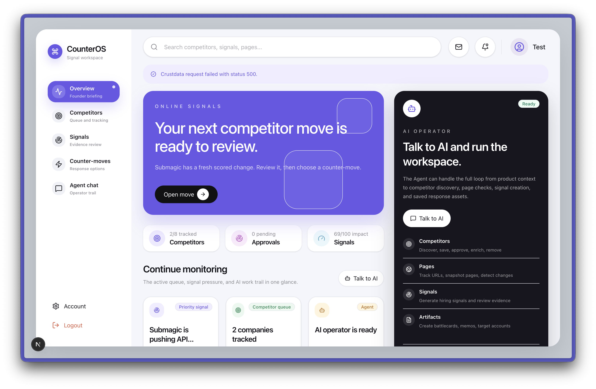

# CounterOS

<p align="center">
  
</p>

CounterOS is an AI competitor intelligence workspace for founders and small teams. It watches competitors, turns scattered evidence into scored signals, and helps decide the next counter-move.

```text
Signal -> evidence -> interpretation -> counter-move -> founder decision
```

## What It Helps With

- Spot competitor changes before they become urgent.
- Separate useful market signals from noisy updates.
- Keep competitor profiles, battlecards, and positioning notes fresh.
- Convert pricing, hiring, website, and market activity into concrete GTM or product actions.
- Give founders one place to review evidence, approve competitors, ask the agent questions, and save response assets.

## Core Features

- **Product profile**: save the company or product idea context, including ICP, category, geography, and wedge.
- **Competitor discovery**: ask the AI agent to find likely competitors from the saved product context.
- **Approval queue**: suggested competitors stay pending until the founder approves, rejects, verifies, ignores, or snoozes them.
- **Manual tracking**: add known competitors directly by domain.
- **Crustdata intelligence**: resolve and enrich approved competitors with company context, where API credentials are configured.
- **Signal feed**: review scored competitor signals with impact, priority, evidence, meaning, and recommended moves.
- **Counter-moves**: compare defensive, offensive, and ignore options for each signal.
- **Artifacts**: save founder-ready outputs such as battlecards, target-account notes, and positioning memos.
- **Agent chat**: use chat as the control surface for discovery, approvals, enrichment, page tracking, snapshots, signal generation, and artifact creation.
- **Tracked pages**: monitor competitor URLs and create page-change signals from snapshots.
- **Background jobs**: Redis/BullMQ worker support is wired for scheduled page snapshots and hiring-signal collection.

## How To Use CounterOS

1. Sign in with the test account below.
2. Save a product profile that describes what you are building and who it is for.
3. Add known competitors manually, or ask Agent Chat to discover likely competitors.
4. Review the pending suggestions and approve only the competitors worth tracking.
5. Enrich competitors, track important pages, and run snapshots or hiring-signal checks.
6. Open Signals to see what changed, why it matters, and what action CounterOS recommends.
7. Use Counter-moves and Artifacts to turn the signal into a battlecard, memo, or next GTM move.

## Test Credentials

```text
Email: test@gmail.com
Password: qwertyui
```

## Tech Snapshot

CounterOS is built with Next.js App Router, TypeScript, SQLite, Drizzle ORM, NextAuth credentials auth, Vercel AI SDK, Crustdata integrations, Redis, and BullMQ workers.
